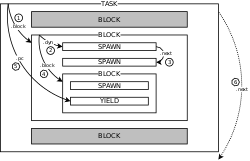

# The Programming Language Ceu

* DESIGN
    * Structured Deterministic Concurrency
    * Event Signaling Mechanisms
    * Lexical Memory Management
    * Hierarchical Tags
* LEXICON
    * Keywords
    * Symbols
    * Operators
    * Identifiers
    * Literals
    * Comments
* TYPES
    * Basic Types
        - `nil` `bool` `char` `number` `pointer` `tag`
    * Collections
        - `tuple` `vector` `dict`
    * Execution Units
        - `func` `coro` `task` `x-coro` `x-task` `x-tasks` `x-track`
    * User Types
* VALUES
    * Literal Values
        - `nil` `bool` `tag` `number` `char` `pointer`
    * Dynamic Values
        - `tuple` `vector` `dict` `func` `coro` `task`
    * Active Values
        - `x-coro` `x-task` `x-tasks` `x-track`
* STATEMENTS
    * Program, Sequences and Blocks
        - `;` `do` `defer` `pass`
    * Where and Thus Clauses
        - `where` `thus`
    * Variables, Declarations and Assignments
        - `val` `var` `set` `...` `err` `evt`
    * Tag Enumerations and Tuple Templates
        - `enum` `data`
    * Calls, Operations and Indexing
        - `f(...)` `x+y` `t[...]` `t.x`
    * Conditionals and Loops
        - `if` `ifs` `loop` `loop if` `loop until` `loop in`
    * Exceptions
        - `throw` `catch`
    * Coroutine Operations
        - `coroutine` `yield` `resume` `toggle` `kill` `status` `spawn` `resume-yield-all`
    * Task Operations
        - `pub` `spawn` `await` `broadcast` `track` `detrack` `tasks` `spawn in`
        - `loop in` `every` `spawn {}` `awaiting` `toggle {}` `par` `par-and` `par-or`
* STANDARD LIBRARY
    * Primary Library
    * Auxiliary Library
* SYNTAX

<!-- CONTENTS -->

# DESIGN

Ceu is a [synchronous programming language][1] that reconciles *[Structured
Concurrency][2]* with *[Event-Driven Programming][3]*.
Ceu extends classical structured programming with three main functionalities:

- Structured Deterministic Concurrency:
    - A set of structured primitives to compose concurrent tasks (e.g.,
      `spawn`, `par-or`, `toggle`).
    - A synchronous and deterministic scheduling policy, which provides
      predictable behavior and safe abortion of tasks.
    - A container primitive to hold dynamic tasks, which automatically releases
      them as they terminate.
- Event Signaling Mechanisms:
    - An `await` primitive to suspend a task and wait for events.
    - A `broadcast` primitive to signal events and awake awaiting tasks.
- Lexical Memory Management:
    - Even dynamic allocation is attached to lexical blocks.
    - Strict escaping rules to preserve structure reasoning.
    - Garbage collection restricted to local references only.

Ceu is inspired by [Esterel][4] and [Lua][5].

Follows an extended list of functionalities in Ceu:

- Dynamic typing
- Statements as expressions
- Dynamic collections (tuples, vectors, and dictionaries)
- Stackless coroutines (the basis of tasks)
- Restricted closures (upvalues must be explicit and final)
- Deferred statements (for finalization)
- Exception handling (throw & catch)
- Hierarchical tuple templates (for data description)
- Seamless integration with C (source-level compatibility)

[1]: https://fsantanna.github.io/sc.html
[2]: https://en.wikipedia.org/wiki/Structured_concurrency
[3]: https://en.wikipedia.org/wiki/Event-driven_programming
[4]: https://en.wikipedia.org/wiki/Esterel
[5]: https://en.wikipedia.org/wiki/Lua_(programming_language)

## Structured Deterministic Concurrency

In structured concurrency, the life cycle of processes or tasks respect the
structure of the source code in blocks.
In this sense, tasks in Ceu are treated in the same way as local variables in
structured programming:
When a [block](#blocks) of code terminates or goes out of scope, all of its
[local variables](#variables-declarations-and-assignments) and
[tasks](#active-values) are deallocated and become inaccessible to enclosing
blocks.
In addition, tasks are properly aborted and finalized by [deferred
statements](#defer).

Tasks in Ceu are built on top of [coroutines](#active-values), which unlike OS
threads, have a predictable run-to-completion semantics, in which they execute
uninterruptedly up to an explicit [yield](#yield) or [await](#await) operation.

The next example illustrates structured concurrency, abortion of tasks, and
deterministic scheduling.
The example uses a `par-or` to spawn two concurrent tasks:
    one that terminates after 10 seconds, and
    another one that increments variable `n` every second, showing its value on
    termination:

```
spawn {
    par-or {
        await 10:s
    } with {
        var n = 0
        defer {
            println("I counted ", n)    ;; invariably outputs 9
        }
        every 1:s {
            set n = n + 1
        }
    }
}
```

The [`par-or`](parallel-blocks) is a structured mechanism that combines tasks
in blocks and rejoins as a whole when one of its tasks terminates,
automatically aborting the others.

The [`every`](every-block) loop in the second task iterates exactly 9 times
before the first task awakes and terminates the composition.
For this reason, the second task is aborted before it has the opportunity to
awake for the 10th time, but its `defer` statement still executes and outputs
`"I counted 9"`.

Being coroutines, tasks are expected to yield control explicitly, which makes
scheduling entirely deterministic.
In addition, tasks awake in the order they appear in the source code, which
makes the scheduling order predictable.
This rule allows us to infer that the example invariably outputs `9`, no matter
how many times we execute it.
Likewise, if the order of the two tasks inside the `par-or` were inverted, the
example would always output `10`.

## Event Signaling Mechanisms

Tasks can communicate through events as follows:

- The [`await`](#await) statement suspends a task until it matches an event
  condition.
- The [`broadcast`](#broadcast) statement signals an event to all awaiting
  tasks.



Active tasks form a dynamic tree representing the structure of the program, as
illustrated in the figure.
This three is traversed on every broadcast in a predictable way, since it
respects the lexical structure of the program:
A task has exactly one active block at a time, which is first traversed `(1)`.
The active block has a list of active tasks, which are traversed in sequence
`(2,3)`, and exactly one nested block, which is traversed after the nested
tasks `(4)`.
After the nested blocks and tasks are traversed, the outer task itself is
traversed at its single yielded execution point `(5)`.
A broadcast traversal runs to completion before proceeding to the next
statement, just like a function call.

The next example illustrates event broadcasts and the tasks traversal.
The example uses an `awaiting` statement to observe an event condition while
executing a nested task.
When the condition is satisfied, the nested task is aborted:

```
spawn {
    awaiting evt==:done {
        par {
            every evt==:tick {
                println(":tick-1")      ;; always awakes first
            }
        } with {
            every evt==:tick {
                println(":tick-2")      ;; always awakes last
            }
        }
    }
    println(":done")
}
broadcast :tick                         ;; --> :tick-1, :tick-2
broadcast :tick                         ;; --> :tick-1, :tick-2
broadcast :done                         ;; --> :done
println("the end")                      ;; --> the end
```

The main block has an outermost `spawn` task, which awaits `:done`, and has two
nested tasks awaiting `:tick` events.
Then, the main block broadcasts three events in sequence.
The first two `:tick` events awake the nested tasks respecting the structure of
the program, printing `:tick-1` and `:tick-2` in this order.
The last event aborts the `awaiting` block and prints `:done`, before
terminating the main block.

## Lexical Memory Management

Ceu respects the lexical structure of the program also when dealing with
dynamic memory allocation.
When a [dynamic value](#dynamic-values) is first assigned to a variable, it
becomes attached to the [block](#block) in which the variable is declared, and
the value cannot escape that block in further assignments or as return
expressions.
This is valid not only for [collections](#constructors) (tuples, vectors, and
dictionaries), but also for [closures](#prototypes),
[coroutines](#active-values), and [tasks](#active-values).
This restriction ensures that terminating blocks (and consequently tasks)
deallocate all memory at once.
*More importantly, it provides static means to reason about the program.*
To overcome this restriction, Ceu also provides an explicit
[drop](#copy-and-drop) operation to deattach a dynamic value from its block.

The next example illustrates lexical memory management and the validity of
assignments:

```
var x1 = [1,2,3]
var x2 = do {
    val y1 = x1         ;; ok, scope of x1>y1
    val y2 = [4,5,6]
    set x1 = y2         ;; no, scope of y2<x1
    [7,8,9]             ;; ok, tuple not yet assigned
}                       ;; deallocates [4,5,6], but not [7,8,9]
```

The assignment `y1=x1` is valid because the tuple `[1,2,3]` held in `x1` is
guaranteed to be in memory while `y1` is visible.
However, the assignment `x1=y2` is invalid because the tuple `[4,5,6]` held in
`y2` is deallocated at the end of the block, but `x1` remains visible.

The next example uses `drop` to reattach a local vector to an outer scope:

```
func to-vector (itr) {      ;; iterable -> vector
    val ret = #[]           ;; vector is allocated locally
    loop in itr, v {
        set ret[+] = v      ;; each value is appended to vector
    }
    drop(ret)                   ;; local vector is moved out
}
```

The function `to-vector` receives an iterable value, and copies all of its
values to a new vector, which is finally returned.
Since the vector `ret` is allocated inside the function, it requires an
explicit `drop` to reattach it to the caller scope.

Note that values of the [basic types](#basic-types), such as numbers, have no
assignment restrictions because they are copied as a whole.
Note also that Ceu still supports garbage collection for dynamic values to
handle references in long-lasting blocks.

## Hierarchical Tags

A [tag](#basic-type) is a basic type of Ceu that represents unique values in a
human-readable form.
Tags are also known as *symbols* or *atoms* in other programming languages.
Any identifier prefixed with a colon (`:`) is a valid tag that is guaranteed to
be unique in comparison to others (i.e., `:x == :x` and `:x /= :y`).
Just like the number `10`, the tag `:x` is a value in itself and needs not to
be declared.
Tags are typically used as keys in dictionaries (e.g., `:x`, `:y`), or as
enumerations representing states (e.g., `:pending`, `:done`).

The next example uses tags as keys in a dictionary:

```
val pos = @[]               ;; a new dictionary
set pos[:x] = 10
set pos.y   = 20            ;; equivalent to pos[:y]=20
println(pos.x, pos[:y])     ;; --> 10, 20
```

Tags can also be used to "tag" dynamic objects, such as dictionaries and
tuples, to support the notion of user types in Ceu.
For instance, the call `tags(pos,:Pos,true)` associates the tag `:Pos` with the
value `pos`, such that the query `tags(pos,:Pos)` returns `true`.

In Ceu, tag identifiers using dots (`.`) can describe user type hierarchies.
For instance, a tag such as `:T.A.x` matches the types `:T`, `:T.A`, and
`:T.A.x` at the same time, as verified by function `sup?`:

```
sup?(:T,     :T.A.x)    ;; --> true
sup?(:T.A,   :T.A.x)    ;; --> true
sup?(:T.A.x, :T.A.x)    ;; --> true
sup?(:T.A.x, :T)        ;; --> false
sup?(:T.A,   :T.B)      ;; --> false
```

The next example illustrates hierarchical tags combined with the function
`tags`:

```
val x = []                  ;; an empty tuple
tags(x, :T.A, true)         ;; x is of user type :T.A
println(tags(x,:T))         ;; --> true
println(tags(x,:T.A))       ;; --> true
println(tags(x,:T.B))       ;; --> false
println(x is? :T)           ;; --> true  (equivalent to tags(x,:T))
```

In the example, `x` is set to user type `:T.A`, which is compatible with types
`:T` and `:T.A`, but not with type `:T.B`.

### Hierarchical Tuple Templates

Ceu also provides a `data` construct to associate a tag with a tuple template
that enumerates field identifiers.
Templates provide field names for tuples, which become similar to *structs* in
C or *classes* in Java.
Each field identifier in the data declaration corresponds to a numeric index in
the tuple, which can then be indexed by field or by number interchangeably.
The next example defines a template `:Pos`, which serves the same purpose as
the dictionary of the first example:

```
data :Pos = [x,y]       ;; a template `:Pos` with fields `x` and `y`
val pos :Pos = [10,20]  ;; declares that `pos` satisfies template `:Pos`
println(pos.x, pos.y)   ;; --> 10, 20
```

In the example, `pos.x` is equivalent to `pos[0]`, and `pos.y` is equivalent to
`pos[1]`.

The template mechanism of Ceu can also describe a tag hierarchy to support
data inheritance, akin to class hierarchies in Object-Oriented Programming.
A `data` description can be suffixed with a block to nest templates, in which
inner tags reuse fields from outer tags.
The next example illustrates an `:Event` super-type, in which each sub-type
appends additional data to the tuple template:

```
data :Event = [ts] {            ;; All events carry a timestamp
    :Key = [key]                ;; :Event.Key [ts,key] is a sub-type of :Event [ts]
    :Mouse = [pos :Pos] {       ;; :Event.Mouse [ts, pos :Pos]
        :Motion = []            ;; :Event.Mouse.Motion [ts, pos :Pos]
        :Button = [but]         ;; :Event.Mouse.Button [ts, pos :Pos, but]
    }
}

val but = :Event.Mouse.Button [0, [10,20], 1]   ;; [ts,[x,y],but]
println(but.ts, but.pos.y, but is :Event.Mouse) ;; --> 0, 20, true
```

Considering the last two lines, a declaration such as
    `val x = :T [...]` is equivalent to
    `val x :T = tags([...], :T, true)`,
which not only tags the tuple with the appropriate user type, but also declares
that the variable satisfies the template.

<!--
 ## Integration with C

The compiler of Ceu converts an input program into an output in C, which is
further compiled to a final executable file.
For this reason, Ceu has source-level compatibility with C, allowing it to
embed native expressions in programs.

- gcc
- :pre
- $x.Tag
- tag,char,bool,number C types
- C errors
-->

# LEXICON

## Keywords

Keywords cannot be used as [variable identifiers](#identifiers).

The following keywords are reserved in Ceu:

```
    and                 ;; and operator                     (00)
    await               ;; await event
    awaiting            ;; awaiting block
    broadcast           ;; broadcast event
    catch               ;; catch exception
    coro                ;; coroutine prototype
    data                ;; data declaration
    defer               ;; defer block
    do                  ;; do block
    else                ;; else block
    enum                ;; enum declaration                 (10)
    err                 ;; exception variable
    every               ;; every block
    evt                 ;; event variable
    export              ;; export block
    false               ;; false value
    func                ;; function prototype
    if                  ;; if block
    it                  ;; implicit parameter
    ifs                 ;; ifs block
    in                  ;; in keyword                       (20)
    in?                 ;; in? operator
    is?                 ;; is? operator
    is-not?             ;; is-not? operator
    loop                ;; loop block
    nil                 ;; nil value
    not                 ;; not operator
    or                  ;; or operator
    par                 ;; par block
    par-and             ;; par-and block
    par-or              ;; par-or block                     (30)
    pass                ;; innocuous expression
    poly                ;; TODO
    pub                 ;; public variable
    resume              ;; resume coroutine
    resume-yield-all    ;; resume coroutine
    set                 ;; assign expression
    spawn               ;; spawn coroutine
    task                ;; task prototype/self identifier
    thus                ;; thus pipe block
    toggle              ;; toggle coroutine/block           (40)
    true                ;; true value
    until               ;; until loop condition
    val                 ;; constant declaration
    var                 ;; variable declaration
    where               ;; where block
    while               ;; while loop condition
    with                ;; with block
    yield               ;; yield coroutine                  (48)
```

## Symbols

The following symbols are reserved in Ceu:

```
    {   }           ;; block/operators delimeters
    (   )           ;; expression delimeters
    [   ]           ;; index/constructor delimeters
    \               ;; lambda declaration
    =               ;; assignment separator
    ->              ;; iterator/ifs/toggle clause
    ;               ;; sequence separator
    ,               ;; argument/constructor separator
    .               ;; index/field discriminator
    ...             ;; variable function/program arguments
    #[              ;; vector constructor
    @[              ;; dictionary constructor
    '   "   `       ;; character/string/native delimiters
    $               ;; native interpolation
    ^               ;; lexer annotation/upvalue modifier
```

## Operators

The following operator symbols can be combined to form operator names in Ceu:

```
    +    -    *    /
    >    <    =    !
    |    &    ~    %
    #    @
```

Operators names cannot clash with reserved symbols (e.g., `->`).

Examples:

```
|>
<|
+++
```

The following identifiers are also reserved as special operators:

```
    not     and     or
    in?     is?     is-not?
```

Operators can be used in prefix or infix notations in
[operations](#calls-and-operations).

## Identifiers

Ceu uses identifiers to refer to variables and operators:

```
ID : [^|^^] [A-Za-z_][A-Za-z0-9_'?!-]*  ;; letter/under/digit/quote/quest/excl/dash
   | `{´ OP `}´                         ;; operator enclosed by braces as identifier
OP : [+-*/><=!|&~%#@]+                  ;; see Operators
```

A variable identifier starts with a letter or underscore (`_`) and is followed
by letters, digits, underscores, single quotes (`'`), question marks (`?`),
exclamation marks (`!`), or dashes (`-`).
A dash must be followed by a letter or digit.
Identifiers can be prefixed with carets (`^` or `^^`), which denote
[closure](#prototypes) access modifiers.

Note that dashes are ambiguous with the minus operator.
For this reason, (i) the minus operation requires spaces between operands
(e.g., `x - 1`), and (ii) variables with common parts in identifiers are
rejected (e.g., `x` vs `x-1` vs `a-x`).

An operator identifier is a sequence of operator symbols
(see [Operators](#operators)).
An operator can be used as a variable identifier when enclosed by braces (`{`
and `}`).

Examples:

```
x               ;; simple var id
my-value        ;; var with dash
empty?          ;; var with question
map'            ;; var with prime
>               ;; simple op id
++              ;; op with multi chars
{{-}}             ;; op as var id
```

## Literals

Ceu provides literals for *nil*, *booleans*, *tags*, *numbers*, *characters*,
*strings*, and *native expressions*:

```
NIL  : nil
BOOL : true | false
TAG  : :[A-Za-z0-9\.\-]+      ;; colon + leter/digit/dot/dash
NUM  : [0-9][0-9A-Za-z\.]*    ;; digit/letter/dot
CHR  : '.' | '\.'             ;; single/backslashed character
STR  : ".*"                   ;; string expression
NAT  : `.*`                   ;; native expression
```

The literal `nil` is the single value of the [*nil*](#basic-types) type.

The literals `true` and `false` are the only values of the [*bool*](#basic-types)
type.

A [*tag*](#basic-types) type literal starts with a colon (`:`) and is followed
by letters, digits, dots (`.`), or dashes (`-`).
A dot or dash must be followed by a letter or digit.

A [*number*](#basic-types) type literal starts with a digit and is followed by
digits, letters, and dots (`.`), and is represented as a *C float*.

A [*char*](#basic-types) type literal is a single or backslashed (`\`)
character enclosed by single quotes (`'`), and is represented as a *C char*.

A string literal is a sequence of characters enclosed by double quotes (`"`).
It is expanded to a [vector](#collections) of character literals, e.g., `"abc"`
expands to `#['a','b','c']`.

A native literal is a sequence of characters interpreted as C code enclosed by
multiple back quotes (`` ` ``).
The same number of backquotes must be used to open and close the literal.
Native literals are detailed further.

All literals are valid [values](#values) in Ceu.

Examples:

```
nil                 ;; nil literal
false               ;; bool literal
:X.Y                ;; tag literal
1.25                ;; number literal
'a'                 ;; char literal
"Hello!"            ;; string literal
`puts("hello");`    ;; native literal
```

### Tags

The following tags are pre-defined in Ceu:

```
    ;; type enumeration

    :nil :tag :bool :char :number :pointer  ;; basic types
    :func :coro :task                       ;; prototypes
    :tuple :vector :dict                    ;; collections
    :x-coro :x-task :x-tasks :x-track       ;; active types

    :yielded :toggled :resumed :terminated  ;; coro status
    :h :min :s :ms                          ;; time unit
    :all :idx :key :val                     ;; iterator modifier
    :global :local                          ;; broadcast target
    :tmp                                    ;; temporary variable
    :rec                                    ;; recursive prototype
    :fake                                   ;; fake task
    :check-now                              ;; await immediate check
    :ceu                                    ;; ceu value
    :error                                  ;; runtime error
    :ref :dynamic :bcast :clear             ;; internal use
```

### Native Literals

A native literal can specify a tag modifier as follows:

```
`:<type> <...>`
`:ceu <...>`
`:pre <...>`
`<...>`
```

The `:<type>` modifier assumes the C code in `<...>` is an expression of the
given type and converts it to Ceu.
The `:ceu` modifier assumes the code is already a value in Ceu and does not
convert it.
The `:pre` modifier assumes the code is a C statement that should be placed
*as is* at the top of the [output file](#integration-with-c).
The lack of a modifier also assumes a C statement, but to be inlined at the
current position.

Native literals can include Ceu expressions with an identifier prefixed by
dollar sign (`$`) suffixed by dot (`.`) with one of the desired types:
    `.Tag`, `.Bool`, `.Char`, `.Number`, `.Pointer`.

Examples:

```
val n = `:number 10`            ;; native 10 is converted to Ceu number
val x = `$n`                    ;; `x` is set to Ceu `n` as is
`:pre #include <x.h>`           ;; includes x.h at the top of the final
`printf("> %f\n", $n.Number);`  ;; outputs `n` as a number
```

## Comments

Ceu provides single-line and multi-line comments.

Single-line comments start with double semi-colons (`;;`) and run until the end
of the line.

Multi-line comments use balanced semi-colons, starting with three or more
semi-colons and running until the same number of semi-colons.
Multi-line comments can contain sequences of semi-colons, as long as they are
shorter than the opening sequence.

Examples:

```
;; a comment        ;; single-line comment
;;;                 ;; multi-line comment
;; a
;; comment
;;;
```

# TYPES

Ceu is a dynamic language in which values carry their own types during
execution.

The function `type` returns the type of a value as a [tag](#basic-types):

```
type(10)  --> :number
type('x') --> :char
```

## Basic Types

Ceu has 6 basic types:

```
nil    bool    char    number    tag    pointer
```

The `nil` type represents the absence of values with its single value
[`nil`](#literals).

The `bool` type represents boolean values with [`true`](#literals) and
[`false`](#literals).
In a boolean context, `nil` and `false` are interpreted as `false` and all
other values from all other types are interpreted as `true`.

The `char` type represents [character literals](#literals).

The `number` type represents real numbers (i.e., *C floats*) with
[number literals](#literals).

The `tag` type represents [tag identifiers](#literals).
Each tag is internally associated with a natural number that represents a
unique value in a global enumeration.
Tags can be explicitly [enumerated](#tag-enumerations-and-tuple-templates) to
interface with [native expressions](#literals).
Tags can form [hierarchies](#hierarchical-tags) to represent
[user types](#user-types) and describe
[tuple templates](#tag-enumerations-and-tuple-templates).

The `pointer` type represents opaque native pointer values from [native
literals](#literals).

## Collections

Ceu has 3 collection types:

```
tuple    vector    dict
```

The `tuple` type represents a fixed collection of heterogeneous values, in
which each numeric index, starting at `0`, holds a value of a (possibly)
different type.

The `vector` type represents a variable collection of homogeneous values, in
which each numeric index, starting at `0`,  holds a value of the same type.

The `dict` type (dictionary) represents a variable collection of heterogeneous
values, in which each index (or key) of any type maps to a value of a
(possibly) different type.

Examples:

```
[1, 'a', nil]           ;; a tuple with 3 values
#[1, 2, 3]              ;; a vector of numbers
@[(:x,10), (:y,20)]     ;; a dictionary with 2 mappings
```

## Execution Units

Ceu provide 3 types of execution units: functions, coroutines, and tasks:

```
func    coro    task
x-coro  x-task  x-tasks  x-track
```

The `func` type represents [function prototypes](#prototypes).

The `coro` type represents [coroutine prototypes](#prototypes), while the
`x-coro` type represents [active coroutines](#active-values).

The `task` type represents [task prototypes](#prototypes), while the `x-task`
type represents [active tasks](#active-values).
The `x-tasks` type represents [task pools](#active-values) holding active
tasks.
The `x-track` type represents [track references](#active-values) pointing to
active tasks.

## User Types

Values from non-basic types (i.e., collections and execution units) can be
associated with [tags](#basic-types) that represent user types.

The function [`tags`](#types-and-tags) associates tags with values, and also
checks if a value is of the given tag:

```
val x = []              ;; an empty tuple
tags(x, :T, true)       ;; x is now of user type :T
println(tags(x,:T))     ;; --> true
```

Tags form [type hierarchies](hierarchical-tags) based on the dots in their
identifiers, i.e., `:T.A` and `:T.B` are sub-types of `:T`.
Tag hierarchies can nest up to 4 levels.

The function [`sup?`](#types-and-tags) checks super-type relations between
tags:

```
println(sup?(:T, :T.A)    ;; --> true
println(sup?(:T.A, :T)    ;; --> false
println(sup?(:T.A, :T.B)  ;; --> false
```

The function [`is?`](#operator-is) checks if values match types or tags:

```
val x = []              ;; an empty tuple
tags(x, :T.A, true)     ;; x is now of user type :T.A
println(x is? :tuple)   ;; --> true
println(x is? :T)       ;; --> true
```

User types do not require to be predeclared, but can appear in [tuple
template](#tag-enumerations-and-tuple-templates) declarations.

# VALUES

As a dynamic language, each value in Ceu carries extra information, such as its
own type.

## Literal Values

A *literal value* does not require dynamic allocation since it only carries
extra information about its type.
All [basic types](#basic-types) have [literal](#literals) values:

```
Types : nil | bool | char | number | pointer | tag
Lits  : `nil´ | `false´ | `true´ | TAG | NUM | CHR | STR | NAT
```

Literals are immutable and are copied between variables and blocks as a whole
without any restrictions.

## Dynamic Values

A *dynamic value* requires dynamic allocation since its internal data is too
big to fit in a literal value.
The following types have dynamic values:

```
Colls  : tuple | vector | dict                  ;; collections
Protos : func | coro | task                     ;; prototypes
Actvs  : x-coro | x-task | x-tasks | x-track    ;; active values (next section)
```

Dynamic values are mutable and are manipulated through references, allowing
that multiple aliases refer to the same value.

Dynamic values are always attached to the enclosing [block](#blocks) in which
they were first assigned, and cannot escape to outer blocks in further
assignments or as return expressions.
This is also valid for active [coroutines](#active-values) and
[tasks](#active-values).
This restriction permits that terminating blocks deallocate all dynamic values
attached to them.

Ceu also provides an explicit [drop](#copy-and-drop) operation to reattach a
dynamic value to an outer scope.

Nevertheless, a dynamic value is still subject to garbage collection, given
that it may loose all references to it, even with its enclosing block active.

### Constructors

Ceu provides constructors for [collections](#collections) to allocate tuples,
vectors, and dictionaries:

```
Cons : `[´ [List(Expr)] `]´             ;; tuple
     | `#[´ [List(Expr)] `]´            ;; vector
     | `@[´ [List(Key-Val)] `]´         ;; dictionary
            Key-Val : ID `=´ Expr
                    | `(´ Expr `,´ Expr `)´
     | TAG `[´ [List(Expr)] `]´         ;; tagged tuple
```

Tuples (`[...]`) and vectors (`#[...]`) are built providing a list of
expressions.

Dictionaries (`@[...]`) are built providing a list of pairs of expressions
(`(key,val)`), in which each pair maps a key to a value.
The first expression is the key, and the second is the value.
If the key is a tag, the alternate syntax `tag=val` may be used (omitting the
tag `:`).

A tuple constructor may also be prefixed with a tag, which associates the tag
with the tuple, e.g., `:X [...]` is equivalent to `tags([...], :X, true)`.
Tag constructors are typically used in conjunction with
[tuple templates](#tag-enumerations-and-tuple-templates)

Examples:

```
[1,2,3]             ;; a tuple
:Pos [10,10]        ;; a tagged tuple
#[1,2,3]            ;; a vector
[(:x,10), x=10]     ;; a dictionary with equivalent key mappings
```

### Prototypes

Ceu supports functions, coroutines, and tasks as prototype values:

```
Func : `func´ [:rec] [`(´ [List(ID)] [`...´] `)´] Block
Coro : `coro´ [:rec] [`(´ [List(ID)] [`...´] `)´] Block
Task : `task´ [:rec] [`(´ [List(ID)] [`...´] `)´] Block
```

Each keyword is followed by an optional `:rec` modifier and a list of
identifiers as parameters enclosed by parenthesis.
If the parenthesis are also omitted, it assumes the single implicit parameter
`it`.
If the prototype is recursive (i.e., refers to itself), the declaration must
use the `:rec` modifier.

The last parameter can be the symbol
[`...`](#variables-declarations-and-assignments), which captures as a tuple all
remaining arguments of a call.

The associated block executes when the unit is [invoked](#TODO).
Each argument in the invocation is evaluated and copied to the parameter
identifier, which becomes a local variable in the execution block.

Ceu supports a restricted form of closures, in which *upvalues* must be
explicit and final.
A closure is a prototype that accesses variables from blocks that terminate,
but which the closure escapes and survives along with these variables, known as
*upvalues*.
Upvalues must be explicitly declared and accessed with the caret prefix (`^`),
and cannot be modified (declarations must use the modifier
[`val`](#variables-declarations-and-assignments))
Finally, inside closures the accesses must be prefixed with double carets
(`^^`).

Examples:

```
func (^v1) {            ;; v1 survives func
    val ^v2 = ^v1 + 1   ;; v2 survives func (outside closure: single caret)
    func () {           ;; closure survives func
        ^^v1 + ^^v2     ;; (inside closure: double caret)
    }
}
```

#### Lambdas

For simple `func` prototypes, Ceu supports a lambda notation:

```
Lambda : `\´ [List(ID)] Block
```

The expression `\<ids> { <es> }` expands to

```
func (<ids>) {
    <es>
}
```

If the list of identifiers is omitted, it assumes the single implicit parameter
`it`.

Examples:

```
val f = \x { 2*x }      ;; f doubles its argument
println(\{it}(10))      ;; prints 10
```

## Active Values

An *active value* corresponds to an active coroutine, task, pool of tasks,
or tracked reference:

```
x-coro  x-task  x-tasks  x-track
```

An active value is still a dynamic value, with all properties described above.

Active coroutines and tasks (`x-coro` and `x-task`) are running instances of
[prototypes](#prototypes) that can suspend themselves in the middle of
execution, before they terminate.
Tasks are also considered coroutines (but not the other way around).
A coroutine retains its execution state and can be
[resumed](#create-resume-spawn) from its current suspension point.

Coroutines have 4 possible status:

1. `yielded`: idle and ready to be resumed
2. `toggled`: ignoring resumes
3. `resumed`: currently executing
4. `terminated`: terminated and unable to be resumed

A coroutine is attached to the enclosing [block](#block) in which it was
instantiated.
This means that it is possible that a coroutine goes out of scope with the
yielded status.
In this case, the coroutine body is aborted and nested [`defer`](#defer)
expressions are properly triggered.

Unlike coroutines, a task can also awake automatically from
[event broadcasts](#broadcast) without an explicit `resume`.
It can also be spawned in a [pool](#pools-of-tasks) of anonymous tasks
(`x-tasks`), which will control the task life cycle and automatically release
it from memory on termination.
In this case, the task is also attached to the block in which the pool is
declared.
Finally, a task can be [tracked](#track-and-detrack) from outside with a safe
reference to it (`x-track`).
A track is cleared when its referred task terminates or goes out of scope.
This is all automated by the Ceu runtime.

The operations on [coroutines](#coroutine-operations) and
[tasks](#tasks-operations) are discussed further.

# STATEMENTS

Ceu is an expression-based language in which all statements are expressions and
evaluate to a value.

## Program, Sequences and Blocks

A program in Ceu is a sequence of statements (expressions), and a block is a
sequence of expressions enclosed by braces (`{` and `}´):

```
Prog  : { Expr [`;´] }
Block : `{´ { Expr [`;´] } `}´
```
Each expression in a sequence may be separated by an optional semicolon (`;´).
A sequence of expressions evaluate to its last expression.

The symbol
[`...`](#variables-declarations-and-assignments) stores the program arguments
as a tuple.

### Blocks

A block delimits a lexical scope for variables and dynamic values:
A variable is only visible to expressions in the block in which it was
declared.
A dynamic value cannot escape the block in which it was created (e.g., from
assignments or returns), unless it is [dropped](#copy-and-drop) out.
For this reason, when a block terminates, all memory that was allocated inside
it is automatically reclaimed.
This is also valid for active [coroutines](#active-values) and
[tasks](#active-values), which are attached to the block in which they were
first assigned, and are aborted on termination.

A block is not an expression by itself, but it can be turned into one by
prefixing it with an explicit `do`:

```
Do : `do´ Block         ;; an explicit block statement
```

Blocks also appear in compound statements, such as
[conditionals](#conditionals), [loops](#loops-and-iterators), and many others.

Examples:

```
do {                    ;; block prints :ok and evals to 1
    println(:ok)
    1
}

do {
    val a = 1           ;; `a` is only visible in the block
}
a                       ;; ERR: `a` is out of scope

var x
do {
    set x = [1,2,3]     ;; ERR: tuple cannot be assigned to outer block
    #[1,2,3]            ;; ERR: vector cannot return from block
}

do {
    drop(#[1,2,3])      ;; OK
}
```

#### Yieldable Blocks

Ceu distinguishes between *tight* and *yieldable* blocks at compile time.
A tight block executes from start to end without any scheduling interruption,
except from calls to tight functions.
An yieldadble block may be preempted when it contains one of the following
expressions:
    `yield`, `resume`, `spawn`, `broadcast`, `toggle`.
In addition, a block is considered yieldable when it calls an yieldable (or
unknown) function, or when it sets variables from enclosing yieldable blocks.

`TODO: restrictions of yieldable blocks`

<!--
Values assigned to variables declared in yieldable blocks
are unsafe in some situations that may generate a compile-time
error:the following situations: `TODO`
-->

Examples:

```
do {                    ;; tight block
    val x = 10
    println(x)
}

do {                    ;; yieldable block
    var x = 10
    println(:before)
    yield()
    println(:after)
    do {                ;; yieldable block
        set x = 20
        println(x)
    }
}
```

### Export

An `export` hides all nested declarations, except those indicated in an
optional list:

```
Export : `export´ [`[´ List(ID | `evt´) `]´] Block
```

Nevertheless, all nested declarations remain active as if they were declared on
the enclosing block.
If the list is omitted, all declarations are hidden.

Examples:

```
export [x] {
    val y = []      ;; y is not exported but remains active
    val x = y       ;; exported x holds tuple that remains in memory
}
println(x)          ;; --> []
println(y)          ;; ERR: y is active but not visible
```

Exports can be used to group related expressions but expose only public
identifiers, as expected from libraries and modules.

### Defer

A `defer` block executes only when its enclosing block terminates:

```
Defer : `defer´ Block
```

Deferred statements execute in reverse order in which they appear in the
source code.

Examples:

```
do {
    println(1)
    defer {
        println(2)      ;; last to execute
    }
    defer {
        println(3)
    }
    println(4)
}                       ;; --> 1, 4, 3, 2
```

### Pass

The `pass` statement permits that an innocuous expression is used in the
middle of a block:

```
Pass : `pass´ Expr
```

Examples:

```
do {
    1           ;; ERR: innocuous expression
    pass 1      ;; OK:  innocuous but explicit
    ...
}
```

## Where and Thus Clauses

Any expression can be suffixed by `where` and `thus` clauses:

```
Expr : Expr [`where´ Block | `thus´ [ID] Block]
```

A `where` clause executes its block before the prefix expression and is allowed
to declare variables that can be used by the expression.

A `thus` clause captures the result of the prefix expression into the given
identifier, and then executes its block.
If the identifier is omitted, it assumes the implicit identifier `it`.

Examples:

```
var x = (2 * y) where { var y=10 }      ;; x=20
(x * x) thus x2 { println(x2) }         ;; --> 400
```

## Variables, Declarations and Assignments

Regardless of being dynamically typed, all variables in Ceu must be declared
before use:

```
Val : `val´ ID [TAG] [`=´ Expr]         ;; constants
Var : `var´ ID [TAG] [`=´ Expr]         ;; variables
Spc : `...´ | `err´ | `evt´             ;; special variables
```

The difference between `val` and `var` is that a `val` is immutable, while a
`var` declaration can be modified by further `set` statements:

```
Set : `set´ Expr `=´ Expr
```

The optional initialization expression assigns an initial value to the
variable, which is set to `nil` otherwise.

The `val` modifier forbids that a name is reassigned, but it does not prevent
that [dynamic values](#dynamic-values) are modified.

Optionally, a declaration can be associated with a [tuple
template](#tag-enumerations-and-tuple-templates) tag, which allows the variable
to be indexed by a field name, instead of a numeric position.
Note that the variable is not guaranteed to hold a value matching the template,
not even a tuple is guaranteed.
The template association is static but with no runtime guarantees.

If the declaration omits the template tag, but the initialization expression is
a [tag constructor](#constructor), then the variable assumes this tag template,
i.e., `val x = :X []` expands to `val x :X = :X []`.

The symbol `...` represents the variable arguments (*varargs*) a function
receives in a call.
In the context of a [function](#prototypes) that expects varargs, it evaluates
to a tuple holding the varargs.
In other scenarios, it evaluates to a tuple holding the program arguments.
When `...` is the last argument of a call, its tuple is expanded as the last
arguments.

The variables `err` and `evt` have special scopes and are automatically setup
in the context of [`throw`](#exceptions) and [`broadcast`](#broadcast)
statements, respectively.
Because `evt` is broadcast from arbitrary scopes, it cannot be assigned to
other variables.

`TODO: :tmp`

Examples:

```
var x
set x = 20              ;; OK

val y = [10]
set y = 0               ;; ERR: cannot reassign `y`
set y[0] = 20           ;; OK

val pos1 :Pos = [10,20] ;; (assumes :Pos has fields [x,y])
println(pos1.x)         ;; --> 10

val pos2 = :Pos [10,20] ;; (assumes :Pos has fields [x,y])
println(pos2.y)         ;; --> 20
```

## Tag Enumerations and Tuple Templates

Tags are global identifiers that need not to be predeclared.
However, they may be explicitly declared when used as enumerations or tuple
templates.

### Tag Enumerations

An `enum` groups related tags in sequence so that they are associated with
numbers in the same order:

```
Enum : `enum´ `{´ List(TAG [`=´ Expr]) `}´
```

Optionally, a tag may receive an explicit numeric value, which is implicitly
incremented for tags in sequence.

Enumerations can be used to interface with external libraries that use
constants to represent a group of related values (e.g., key symbols).

Examples:

```
enum {
    :Key-Left = `:number KEY_LEFT`  ;; explicitly associates with C enumeration
    :Key-Right                      ;; implicitly associates with remaining
    :Key-Up                         ;;  keys in sequence
    :Key-Down
}
if lib-key-pressed() == :Key-Up {
    ;; lib-key-pressed is an external library
    ;; do something if key UP is pressed
}
```

### Tuple Templates

A `data` declaration associates a tag with a tuple template, which associates
tuple positions with field identifiers:

```
Temp : `data´ Data
            Data : TAG `=´ `[´ List(ID [TAG]) `]´
                    [`{´ { Data } `}´]
```

After the keyword `data`, a declaration expects a tag followed by `=` and a
template.
A template is surrounded by brackets (`[´ and `]´) to represent the tuple, and
includes a list of identifiers, each mapping an index into a field.
Each field can be followed by a tag to represent nested templates.

Then, a [variable declaration](#variables-declarations-and-assignments) can
specify a tuple template and hold a tuple that can be accessed by field.

Examples:

```
data :Pos = [x,y]                       ;; a flat template
val pos :Pos = [10,20]                  ;; pos uses :Pos as template
println(pos.x, pos.y)                   ;; --> 10, 20

data :Dim = [w,h]
data :Rect = [pos :Pos, dim :Dim]       ;; a nested template
val r1 :Rect = [pos, [100,100]]         ;; r uses :Rect as template
println(r1.dim, r1.pos.x)               ;; --> [100,100], 10

val r2 = :Rect [[0,0],[10,10]]          ;; combining tag template/constructor
println(r2 is? :Rect, r2.dim.h)         ;; --> true, 0
```

Based on [tags and sub-tags](#user-types), tuple templates can define
hierarchies and reuse fields from parents.
A declaration can be followed by a list of sub-templates enclosed by curly
braces (`{` and `}`), which can nest to at most 4 levels.
Each nested tag identifier assumes an implicit prefix of its super-tag, e.g.,
in the context of tag `:X`, a sub-tag `:A` is actually `:X.A`.
Templates are reused by concatenating a sub-template after its corresponding
super-templates, e.g., `:X.A [a]` with `:X [x]` becomes `:X.A [x,a]`.

Examples:

```
data :Event = [ts] {            ;; All events carry a timestamp
    :Key = [key] {              ;; :Event.Key [ts,key] is a sub-type of :Event [ts]
    :Mouse = [pos :Pos]         ;; :Event.Mouse [ts, pos :Pos]
        :Motion = []            ;; :Event.Mouse.Motion [ts, pos :Pos]
        :Button = [but]         ;; :Event.Mouse.Button [ts, pos :Pos, but]
    }
}

val but = :Event.Mouse.Button [0, [10,20], 1]
val evt :Event = but
println(evt.ts, but.pos.y)      ;; --> 0, 20
```

#### Template Casting

An expression can be prefixed with a tag such that the expression base is
casted into the tag template:

```
Cast : TAG Expr
```

Examples:

```
data :Pos = [x,y]
val p = ...
println(:Pos p.x)       ;; `p` is casted to `:Pos`
```

## Calls, Operations and Indexing

### Calls and Operations

In Ceu, calls and operations are equivalent, i.e., an operation is a call that
uses an [operator](#operatos) with prefix or infix notation:

```
Call : OP Expr                      ;; unary operation
     | Expr OP Expr                 ;; binary operation
     | Expr `(´ [List(Expr)] `)´    ;; function call
     | Expr Lambda                  ;; function call
```

Operations are interpreted as function calls, i.e., `x + y` is equivalent to
`{+} (x, y)`.

A call expects an expression of type [`func`](#prototypes) and an optional list
of expressions as arguments enclosed by parenthesis.
If the argument is a [lambda expression](#lambdas), then the parenthesis can be
omitted.
Each argument is expected to match a parameter of the function declaration.
A call transfers control to the function, which runs to completion and returns
control with a value, which substitutes the call.

As discussed in [Identifiers](#identifiers), the binary minus requires spaces
around it to prevent ambiguity with identifiers containing dashes.

Examples:

```
#vec            ;; unary operation
x - 10          ;; binary operation
{{-}}(x,10)       ;; operation as call
f(10,20)        ;; normal call
```

### Indexes and Fields

[Collections](#collections) in Ceu (tuples, vectors, and dictionaries) are
accessed through indexes or fields:

```
Index : Expr `[´ Expr `]´
Field : Expr `.´ (NUM | ID | `pub´)
```

An index operation expects an expression as a collection, and an index enclosed
by brackets (`[` and `]`).
For tuples and vectors, the index must be an number.
For dictionaries, the index can be of any type.

The operation evaluates to the current value the collection holds on the index,
or `nil` if non existent.

A field operation expects an expression as a collection, a dot separator (`.`),
and a field identifier.
A field operation expands to an index operation as follows:
For a tuple or vector `v`, and a numeric identifier `i`, the operation expands
to `v[i]`.
For a dictionary `v`, and a [tag literal](#literals) `k` (with the colon `:`
omitted), the operation expands to `v[:k]`.

A [task](#active-values) `t` also relies on a field operation to access its
public field `pub` (i.e., `t.pub`).

A [variable](#variables-declarations-and-assignments) associated with a
[tuple template](#tag-enumerations-and-tuple-templates) can also be indexed
using a field operation.

Examples:

```
tup[3]      ;; tuple access by index
tup.3       ;; tuple access by numeric field

vec[i]      ;; vector access by index

dict[:x]    ;; dict access by index
dict.x      ;; dict access by field

t.pub       ;; task public field

val t :T    ;; tuple template
t.x
```

#### Peek, Push, Pop

The *ppp operators* (peek, push, pop) manipulate a vector as a stack:

```
PPP : Expr `[´ (`=´|`+´|`-´) `]´
```

A peek operation `vec[=]` sets or gets the last element of a vector.
The push operation `vec[+]` adds a new element to the end of a vector.
The pop operation `vec[-]` gets and removes the last element of a vector.

Examples:

```
val stk = [1,2,3]
println(stk[=])         ;; --> 3
set stk[=] = 30
println(stk)            ;; --> [1, 2, 30]
println(stk[-])         ;; --> 30
println(stk)            ;; --> [1, 2]
set stk[+] = 3
println(stk)            ;; --> [1, 2, 3]
```

### Precedence and Associativity

Operations in Ceu can be combined in complex expressions with the following
precedence priority (from higher to lower):

```
1. sufix  operations       ;; t[0], x.i, f(x)
2. prefix operations       ;; -x, #t
3. binary operations       ;; x + y
```

Currently, binary operators in Ceu have no precedence or associativity rules,
requiring parenthesis for disambiguation:

```
Parens : `(´ Expr `)´
```

Examples:

```
#f(10).x        ;; # ((f(10)) .x)
x + 10 - 1      ;; ERR: requires parenthesis
- x + y         ;; (-x) + y
```

## Conditionals and Loops

### Conditionals

Ceu supports conditionals as follows:

```
If  : `if´ [ID [TAG] `=´] Expr (Block | `->´ Expr)
        [`else´  (Block | `->´ Expr)]
```

An `if` tests a condition expression and executes one of the two possible
branches.
If the condition is [true](#basic-types), the `if` executes the first branch.
Otherwise, it executes the optional `else` branch.

The condition expression can be can be assigned to an optional
[variable declaration](#variables-declarations-and-assignments) and can be
accessed in the branches.

The branches can be either a block or a simple expression prefixed by the
symbol `->`.

Examples:

```
val max = if x>y -> x -> y
if x = f() {
    print(x)
}
```

Ceu also supports `ifs` to test multiple conditions:

```
Ifs : `ifs´ [[ID [TAG] `=´] Expr] `{´ {Case} [Else] `}´
        Case : OP Expr (Block | `->´ Expr)
             | [ID [TAG] `=´] Expr (Block | `->´ Expr)
        Else : `else´ (`->´ Expr | Block)
```

The `ifs` statement supports multiple cases with a test condition and an
associated branch.
The conditions are tested in sequence, until one is true and its associated
branch executes.
The optional `else` branch executes if no conditions are true.

Like in an `if`, branches can be blocks or simple expressions prefixed by `->`.

If a head condition expression is provided, test cases can assume its value
appears before a binary operator and the right operand.

The head condition and each case condition can be assigned to an optional
[variable declaration](#variables-declarations-and-assignments) and can be
accessed in the branches.

Examples:

```
ifs x = f() {
    == 10      -> println("x == 10")
    is? :tuple -> println("x is a tuple")
    g(x) > 10  -> println("g(x) > 10")
    y=h(x)     -> println(y)
    else {
        throw(:error)
    }
}
```

### Loops and Iterators

Ceu supports loops and iterators as follows:

```
Loop : `loop´
            [`in´ Iter [`,´ ID [TAG]]]  ;; optional iterator (see further)
            [Test]                      ;; optional head test
            Block                       ;; mandatory block
            [{Test Block}]              ;; optional test/block
            [Test]                      ;; optional tail test

Test : (`until´ | `while´) [ID [TAG] `=´] Expr
```

A `loop` executes a block of code continuously until a condition is met.

A `loop` has an optional iterator pattern that changes the value of a variable
on each iteration.
If the variable becomes `nil`, then the loop terminates.
If the variable identifier is omitted, it assumes the implicit identifier `it`.

A `loop` has optional head and tail tests which, if satisfied, terminate the
loop.

The mandatory block can be extended with a list of test-block clauses that
can terminate the loop when a test succeeds.
The blocks are all considered to be in the same scope such that variables
declared in a block are visible in further blocks.

A test checks an expression and succeeds, terminating the loop, `until` the
expression is `true` or `while` the expression `false`.
The condition expression can assigned to an optional
[variable declaration](#variables-declarations-and-assignments) and can be
accessed in further blocks.

Note that there is no `break` statement in Ceu, which must be substituted by
proper top-level test conditions.

Examples:

```
var i = 0
loop while i<5 {       ;; --> 0,1,2,3,4
    println(i)
    set i = i + 1
}

loop {
    val x = random-next() % 100
    println(x)
} until x > 80 {
    val y = random-next() % 100
    println(x+y)
} until x+y > 80
```

#### Iterators

Loops in Ceu supports generic iterators, numeric iterators, and tasks
iterators:

```
Iter : Expr                             ;; generic iterator
     | (`[´ | `(´)                      ;; numeric iterator
       Expr `->´ Expr
       (`]´ | `)´)
       [`,´ :step (`-´|`+´) Expr]
     | `:tasks´ Expr                    ;; tasks iterator
```

A generic [iterator](#iterator) is expected to evaluate to a tuple `(f,...)`
holding a function `f` at index `0`, and any other state required to operate at
the other indexes.
The function `f` expects the iterator tuple itself as argument, and returns its
next value or `nil` to signal termination.
The loop calls the function repeatedly, assigning each result to the loop
variable, which can be accessed in the loop block.

The function [`iter`](#iterator) in the [auxiliary library](#auxiliary-library)
converts many values, such as vectors and coroutines, into iterators, so that
they can be traversed in loops.

A numeric loop expects an interval `x -> y`, with open (`(` and `)`) or closed
(`[` and `]`) delimiters, an optional signed `:step` expression (which defaults
to `+1`).
The loop terminates when `x` reaches `y` in the direction of the step sign.
After each loop iteration, the step is added to `x`.

Tasks iterators are discussed in [Pools of Tasks](#pools-of-tasks).

Examples:

```
val f = func (t) {              ;; t = [f, V]
    val ret = t.1               ;; V
    set t.1 = t.1 - 1           ;; V = V - 1
    ((ret > 0) and ret) or nil  ;; V or nil
}
loop in [f, 5], v {
    println(v)                  ;; --> 5, 4, 3, 2, 1
}

loop in iter([10,20,30]) {
    println(it)                 ;; --> 10, 20, 30
}

loop in [10 -> 0), :step -2 {
    println(it)                 ;; --> 10, 8, 6, 4, 2
}
```

## Exceptions

A `throw` raises an exception that terminates all enclosing blocks up to a
matching `catch` block:

```
Throw : `throw´ `(´ Expr `)´
Catch : `catch´ Expr Block
```

A `throw` receives an expression that is assigned to the special variable
`err`, which is only visible to enclosing `catch` condition expressions.
A `throw` is propagated upwards and aborts all enclosing [blocks](#blocks) and
[execution units](#prototypes) (functions, coroutines, and tasks) on the way.
When crossing an execution unit, a `throw` jumps back to the calling site and
continues to propagate upwards.

A `catch` executes its associated block normally, but also registers a
condition expression to be compared against `err` when a `throw` is crossing
it.
If they match, the exception is caught and the `catch` terminates and evaluates
to `err`, also aborting its associated block, and properly triggering nested
[`defer`](#defer) statements.

To match an exception, the `catch` expression can access `err` and needs to
evaluate to `true`.
If the matching expression `x` is of type [tag](#basic-types), it expands to
match `err is? x`, allowing to check for [tuple
templates](#tag-enumerations-and-tuple-templates).

Examples:

```
val x = catch (err == 1) {
    throw(1)
    println("unreachable")
}
println(x)              ;; --> 1
```

```
catch err == 1 {        ;; catches
    defer {
        println(1)
    }
    catch err == 2 {    ;; no catches
        defer {
            println(2)
        }
        throw(1)        ;; throws
        ;; unreachable
    }
    ;; unreachable
}                       ;; --> 2, 1
```

```
func f () {
    catch :Err.One {                  ;; catches specific error
        defer {
            println(1)
        }
        throw(:Err.Two ["err msg"])   ;; throws another error
    }
}
catch :Err {                          ;; catches generic error
    defer {
        println(2)
    }
    f()
    ;; unreachable
}                                     ;; --> 1, 2
```

## Coroutine Operations

The basic API for coroutines has 6 operations:

1. [`coroutine`](#create-resume-spawn): creates a new coroutine from a prototype
2. [`yield`](#yield): suspends the resumed coroutine
3. [`resume`](#create-resume-spawn): starts or resumes a coroutine from its current suspension point
4. [`toggle`](#toggle): either ignore or acknowledge resumes
5. [`kill`](#TODO): `TODO`
6. [`status`](#status): returns the coroutine status

Note that `yield` is the only operation that is called from the coroutine
itself, all others are called from the user code controlling the coroutine.
Just like call arguments and return values from functions, the `yield` and
`resume` operations can transfer values between themselves.

Examples:

```
coro F (a) {                ;; first resume
    println(a)              ;; --> 10
    val c = yield(a + 1)    ;; returns 11, second resume, receives 12
    println(c)              ;; --> 12
    c + 1                   ;; returns 13
}
val f = coroutine(F)        ;; creates `f` from prototype `F`
val b = resume f(10)        ;; starts  `f`, receives `11`
val d = resume f(b+1)       ;; resumes `f`, receives `13`
println(status(f))          ;; --> :terminated
```

```
coro F () {
    defer {
        println("aborted")
    }
    yield()
}
do {
    val f = coroutine(F)
    resume f()
}                           ;; --> aborted
```

### Create, Resume, Spawn

The operation `coroutine` creates a new coroutine from a
[prototype](#prototypes).
The operation `resume` executes a coroutine starting from its last suspension
point.
The operation `spawn` creates and resumes a coroutine:

```
Create : `coroutine´ `(´ Expr `)´
Resume : `resume´ Expr `(´ Expr `)´
Spawn  : `spawn´ Expr `(´ Expr `)´
       | `spawn´ `coro´ Block
```

The operation `coroutine` expects a coroutine prototype (type
[`coro`](#execution-units) or [`task`](#execution-units)) and returns its
active reference (type [`x-coro`](#execution-units) or
[`x-task`](#executions-units)).

The operation `resume` expects an active coroutine, and resumes it.
The coroutine executes until it yields or terminates.
The `resume` evaluates to the argument of `yield` or to the coroutine return
value.

The operation `spawn T(...)` creates the coroutine `T`, resumes it passing
`(...)`, and returns its active reference.

A `spawn coro` spawns its block as an anonymous coroutine, returning its
active reference.

### Status

The operation `status` returns the status of the given active coroutine:

```
Status : `status´ `(´ Expr `)´
```

As described in [Active Values](#active-values), a coroutine has 4 possible
status:

1. `yielded`: idle and ready to be resumed
2. `toggled`: ignoring resumes
3. `resumed`: currently executing
4. `terminated`: terminated and unable to be resumed

### Yield

The operation `yield` suspends the execution of a running coroutine:

```
Yield : `yield´ `(´ Expr `)´
```

An `yield` expects an expression between parenthesis that is returned to whom
resumed the coroutine.
Eventually, the suspended coroutine is resumed again with a value and the whole
`yield` is substituted by that value.

<!--
If the resume came from a [`broadcast`](#broadcast), then the given expression is
lost.
-->

### Resume/Yield All

The operation `resume-yield-all´ continuously resumes the given active
coroutine, collects its yields, and yields upwards each value, one at a time.
It is typically use to delegate job of an outer coroutine transparently to an
inner coroutine:

```
All : `resume-yield-all´ Expr `(´ [Expr] `)´
```

The operation expects an active coroutine and an optional initial resume value
between parenthesis, which defaults to `nil`.
A `resume-yield-all <co> (<arg>)` expands as follows:

```
do {
    val co  = <co>                  ;; given active coroutine
    var arg = <arg>                 ;; given initial value (or nil)
    loop {
        val v = resume co(arg)      ;; resumes with current arg
        if (status(co) /= :terminated) or (v /= nil) {
            set arg = yield(v)      ;; takes next arg from upwards
        }
    } until (status(co) == :terminated)
    arg
}
```

The loop in the expansion continuously resumes the target coroutine with a
given argument, collects its yielded value, yields the same value upwards.
Then, it expects to be resumed with the next target value, and loops until the
target coroutine terminates.

Examples:

```
coro G (b1) {                           ;; b1=1
    coro L (c1) {                       ;; c1=4
        val c2 = yield(c1+1)            ;; y(5), c2=6
        val c3 = yield(c2+1)            ;; y(7), c3=8
        c3                              ;; 8
    }
    val l = coroutine(L)
    val b2 = yield(b1+1)                ;; y(2), b2=3
    val b3 = resume-yield-all l(b2+1)   ;; b3=9
    val b4 = yield(b3+1)                ;; y(10)
    b4
}

val g = coroutine(G)
val a1 = resume g(1)                    ;; g(1), a1=2
val a2 = resume g(a1+1)                 ;; g(3), a2=5
val a3 = resume g(a2+1)                 ;; g(6), a3=7
val a4 = resume g(a3+1)                 ;; g(8), a4=8
val a5 = resume g(a4+1)                 ;; g(9), a5=10
println(a1, a2, a3, a4, a5)             ;; --> 2, 5, 7, 8, 10
```

### Toggle

The operation `toggle` configures an active coroutine to ignore or acknowledge
further `resume` operations:

```
Toggle : `toggle´ Expr `(´ Expr `)´
```

A `toggle` expects an active coroutine and a [boolean](#basic-types) value
between parenthesis.
If the toggle is set to `true`, the coroutine will ignore further `resume`
operations, otherwise it will execute normally.

## Task Operations

A task can refer to itself with the identifier `task`.

A task has a public `pub` variable that can be accessed as a
[field](#indexes-and-fields):
    internally as `task.pub`, and
    externally as `x.pub` where `x` is a reference to the task.

In addition to the coroutines API, tasks also rely on the following operations:

1. [`spawn`](#create-resume-spawn): creates and resumes a new task from a prototype
2. [`await`](#await): yields the resumed task until it matches an event
3. [`broadcast`](#broadcast): broadcasts an event to all tasks

Examples:

```
task T (x) {
    set task.pub = x            ;; sets 1 or 2
    await :number               ;; awakes from broadcast
    println(task.pub + evt)     ;; --> 11 or 12
}
val t1 = spawn T(1)
val t2 = spawn T(2)
println(t1.pub, t2.pub)         ;; --> 1, 2
broadcast 10                    ;; evt = 10
```

```
task T () {
    await true
}
val tsk = spawn T()
val trk = track(tsk)
println(tsk, detrack(trk))      ;; --> x-task: 0x...    x-task: 0x...
broadcast true                  ;; terminates task, clears track
println(tsk, detrack(trk))      ;; --> x-task: 0x...    x-task: nil
```

```
task T () {
    await :number
    println(evt)
}
val ts = tasks()                ;; pool of tasks
do {
    spawn in ts, T()            ;; attached to outer pool,
    spawn in ts, T()            ;; not to enclosing block
}
broadcast 10                    ;; --> 10 \n 10
```

### Await

The operation `await` suspends the execution of a running task until a
condition is true:

```
Await : `await´ [`:check-now`] (
            | Expr
            | TAG [`,´ Expr]
            | [Expr `:h´] [Expr `:min´] [Expr `:s´] [Expr `:ms´]
        )
```

An `await` is expected to be used in conjunction with event
[broadcasts](#broadcast), allowing the condition expression to query the
variable `evt` with the occurring event.

All await variations are expansions based on `yield`.

An `await <e>` expands as follows:

```
yield()                 ;; omit if :check-now is set
loop if not <e> {
    yield ()
}
```

The expansion yields while the condition is false.
When the optional tag `:check-now` is set, the condition is tested immediately,
and the coroutine may not yield at all.

An `await <tag>, <e>` expands as follows:

```
yield() ;; (unless :check-now)
loop if not ((evt is? <tag>) [and <e>]) {
    yield ()
}
```

The expansion yields until the `evt` is of the given tag.
The optional `<e>` is also required to be true if provided.

Given a time expression, an `await <time>` sleeps for a number of milliseconds
and expands as follows:

```
val ms = <...>              ;; time expression
loop if ms > 0 {
    await :frame            ;; assumes a :frame event
    set ms = ms - evt[0]    ;;  with the elapsed ms at [0]
}
```

The expansion yields until the expected number of milliseconds elapses from
occurrences of `:frame` events representing the passage of time.
The time expression expects the format `<e>:h <e>:min <e>:s <e>:ms` and is
converted to milliseconds.

`TODO: configurable :frame event`

Examples:

```
await true                          ;; awakes on any broadcast
await :key, evt.press==:release     ;; awakes on :key with press=:release
await 1:h 10:min 30:s               ;; awakes after the specified time
```

### Broadcast

The operation `broadcast` signals an event to awake [awaiting](#await) tasks:

```
Bcast : `broadcast´ [`in´ Expr `,´] Expr
```

A `broadcast` expects an event expression and an optional target between `in`
and `,`.
The event is any valid expression, which is assigned to the special variable
[`evt`](#variables-declarations-and-assignments) and can be queried by await
operations to decide if tasks should awake.
The target expression restricts the scope of the broadcast:
    if set to `:local`, it is restricted to tasks in the enclosing block;
    if set to `:task`, it is restricted to tasks nested in the current task;
    if set to an active task expresion, it is restricted to that task; and
    if omited or set to `:global`, all tasks receive the broadcast.

Examples:

```
<...>
task T () {
    <...>
    do {
        <...>
        val x = spawn X()
        <...>
        val e = :Evt [1,2]
        broadcast in :local,  e     ;; restricted to enclosing `do { ... }`
        broadcast in :task,   e     ;; restricted to enclosing `task T () { ... }`
        broadcast in x,       e     ;; restricted to spawned `x`
        broadcast in :global, e     ;; no restriction
        broadcast e                 ;; no restriction
    }
}
```

### Track and Detrack

The `track` and `detrack` operations manipulate [dynamic
references](#active-values) to tasks:

```
Track   : `track´ `(´ Expr `)´
Detrack : `detrack´ `(´ Expr `)´
```

A `track` expects an [active task](#active-values) and returns a reference to
it.
A reference is automatically cleared when the referred task terminates or goes
out of scope.
A reference cannot manipulate a task directly, requiring a `detrack`.

A `detrack` expects a [track reference](#active-values) and returns the
referred task or `nil` if it was cleared.
Because it is a reference that terminate, the result of `detrack` cannot be
cannot be assigned to other variables.

`TODO: across yield`


<!--
They are both functions in the [primary library](#primary-library) of Ceu.
-->

### Pools of Tasks
### Syntax Extensions Blocks
#### Every Block

An `every` block is a loop that makes an iteration whenever an await condition
is satisfied:

```
Every : `every´ <awt>
            [Test]              ;; optional head test
            Block               ;; mandatory block
            [{Test Block}]      ;; optional test/block
            [Test]              ;; optional tail test
```

An `every` expands to a [loop](#loops-and-iterators) as follows:

```
loop {
    await <awt>
    <...>       ;; tests and blocks
}
```

Any [`await`](#await) variation can be used as `<awt>`.
It is assumed that `<...>` does not `await` to satisfy the meaning of "every".

Examples:

```
every 1:s {
    println("1 more second has elapsed")
}
```

#### Spawn Blocks

A spawn block spawns an anonymous task:

#### Parallel Blocks

A parallel block spawns multiple anonymous tasks concurrently:

```
Par     : `par´     Block { `with´ Block }
Par-And : `par-and´ Block { `with´ Block }
Par-Or  : `par-or´  Block { `with´ Block }
```

A `par` never rejoins, even if all spawned tasks terminate.
A `par-and` rejoins when all spawned tasks terminate.
A `par-or` rejoins when any spawned task terminates, aborting the others.

A `par { <es1> } with { <es2> }` expands as follows:

```
do {
    spawn {
        <es1>           ;; first task
    }
    spawn {
        <es2>           ;; second task
    }
    await false         ;; never rejoins
}

```

A `par-and { <es1> } with { <es2> }` expands as follows:

```
do {
    val t1 = spawn {
        <es1>           ;; first task
    }
    val t2 = spawn {
        <es2>           ;; second task
    }
    await :check-now (  ;; rejoins when all tasks terminate
        status(t1)==:terminated and status(t2)==:terminated
    )
}
```

A `par-or { <es1> } with { <es2> }` expands as follows:

```
do {
    val t1 = spawn {
        <es1>           ;; first task
    }
    val t2 = spawn {
        <es2>           ;; second task
    }
    await :check-now (  ;; rejoins when any task terminates
        status(t1)==:terminated or status(t2)==:terminated
    )
}                       ;; aborts other active tasks
```

Examples:

```
par {
    every 1:s {
        println("1 second has elapsed")
    }
} with {
    every 1:min {
        println("1 minute has elapsed")
    }
} with {
    every 1:h {
        println("1 hour has elapsed")
    }
}
println("never reached")
```

```
par-or {
    await 1:s
} with {
    await :X
    println(":X occurred before 1 second")
}
```

```
par-and {
    await :X
} with {
    await :Y
}
println(":X and :Y have occurred")
```

#### Awaiting Block

An `awaiting` block executes a given block until an await condition is
satisfied:

```
Awting : `awaiting´ <awt> Block
```

An `awaiting <awt> { <es> }` expands to a [`par-or`](#parallel-blocks) as
follows:

```
par-or {
    await <awt>
} with {
    <es>
}
```

Examples:

```
awaiting 1:s {
    every :X {
        println("one more :X occurred before 1 second")
    }
}
```

#### Toggle Block

A `toggle` block executes a given block and [toggles](#toggle) it according to
given off and on events:

```
Toggle : `toggle´ Await `->´ Await Block
```

A `toggle <off> -> <on> { <es> }` expands as follows:

```
do {
    val t = spawn {
        <es>
    }
    awaiting :check-now t {
        loop {
            await <off>
            toggle t(false)
            await <on>
            toggle t(true)
        }
    }
    t.pub
}
```

The block executes normally, until `<off>` toggles it off, until `<on>` toggles
if on again.
The whole composition terminates when the task representing the given block
terminates.

<!-- ---------------------------------------------------------------------- -->

# STANDARD LIBRARY

## Primary Library

The primary library provides functions and operations that are primitive in
the sense that they cannot be written in Ceu itself:

- `/=`:             [Equality Operators](#equality-operators)
- `==`:             [Equality Operators](#equality-operators)
- `copy`:           [Copy and Drop](#copy-and-drop)
- `coroutine`:      [Create, Resume, Spawn](#create-resume-spawn)
- `detrack`:        [Track and Detrack](#track-and-detrack)
- `drop`:           [Copy and Drop](#copy-and-drop)
- `next`:           [Dictionary Next](#dictionary-next)
- `print`:          [Print](#print)
- `println`:        [Print](#print)
- `status`:         [Status](#status)
- `sup?`:           [Types and Tags](#types-and-tags)
- `tags`:           [Types and Tags](#types-and-tags)
- `tasks`:          [Pool of Tasks](#pool-of-tasks)
- `throw`:          [Exceptions](#exceptions)
- `to-number`:      [Conversions](#conversions)
- `to-string`:      [Conversions](#conversions)
- `to-tag`:         [Conversions](#conversions)
- `track`:          [Track and Detrack](#track-and-detrack)
- `type`:           [Types and Tags](#types-and-tags)

### Equality Operators

```
func {{==}} (v1, v2)  ;; --> yes/no
func {{/=}} (v1, v2)  ;; --> yes/no
```

The operator `==` compares two values `v1` and `v2` and returns a boolean.
The operator `/=` is the negation of `==`.

To be considered equal, first the values must be of the same type.
In addition, [literal values](#literal-values) are compared *by value*, while
[Dynamic Values](#dynamic-values) and [Active Values](#active-values) are
compared *by reference*.
<!--
The exception are tuples, which are compared by value, i.e., they must be of
the same size, with all positions having the same value (using `==`).
-->

Examples:

```
1 == 1          ;; --> true
1 /= 1          ;; --> false
1 == '1'        ;; --> false
#[1] == #[1]    ;; --> false
[1] == [1]      ;; --> false
```

### Types and Tags

```
func type (v)           ;; --> :type
func sup? (sup, sub)    ;; --> yes/no
func string-to-tag (s)  ;; --> :tag
func tags (v, t, set)   ;; --> v
func tags (v, t)        ;; --> yes/no
```

The function `type` receives a value `v` and returns its [type](#types) as one
of these tags:
    `:nil`, `:bool`, `:char`, `:number`, `:pointer`, `:tag`,
    `:tuple`, `:vector`, `:dict`,
    `:func`, `:coro`, `:task`, `:x-coro`, `:x-task`, `:x-tasks`, `:x-track`.

The function `sup?` receives a tag `sup`, a tag `sub`, and returns a boolean
to answer if `sup` is a [super-tag](#hierarchical-tags) of `sub`.

The function `tags` sets or queries tags associated with values of [non-basic
types](#user-types).
To set or unset a tag, the function receives a value `v`, a tag `t`, and a
boolean `set` to set or unset the tag.
The function returns the same value passed to it.
To query a tag, the function receives a value `v`, a tag `t` to check, and
returns a boolean to answer if the tag (or any sub-tag) is associated with the
value.

Examples:

```
type(10)                        ;; --> :number
val x = tags([], :x, true)      ;; value x=[] is associated with tag :x
tags(x, :x)                     ;; --> true
```

### Conversions

```
func to-number (v)  ;; --> number
func to-string (v)  ;; --> "string"
func to-tag (v)     ;; --> :tag
```

The conversion functions receive any value `v` and try to convert it to a value
of the specified type.
If the conversion is not possible, they return `nil`.

Examples:

```
to-number("10")     ;; --> 10
to-number([10])     ;; --> nil
to-string(10)       ;; --> "10"
to-tag(":number")   ;; --> :number
```

### Copy and Drop

```
func drop (v)   ;; --> v
func copy (v)   ;; --> v'
```

The function `copy` makes a deep copy of the given value `v`.
Only values of the [basic types](#basic-types) and [collections](#collections)
are supported.

The function `drop` makes a deep drop of the given value `v`.
A drop [deattaches](#lexical-memory-management) the value from its current
[block](#blocks), allowing it to be reattached to an outer scope.
Only values of the [basic types](#basic-types) and [collections](#collections)
are supported.

Examples:

```
copy(10)            ;; --> 10
copy(func() {})     ;; --> ERR: cannot copy function
copy([1,[2],3])     ;; --> [1,[2],3]

val v = 10
drop(v)             ;; --> 10 (innocuous drop)

val u = do {
    val t = [10]
    drop(t)         ;; --> [10] (deattaches from `t`, reattaches to `u`)
}
```

### Dictionary Next

```
func next (d, k)
```

The function `next` allows to enumerate the keys of a dictionary.
It receives a dictionary `d` and a key `k`, and returns the next key after `k`.
If `k` is `nil`, the function returns the initial key.
The function returns `nil` if there are no reamining keys to enumerate.

### Print

```
func print (...)
func println (...)
```

The functions `print` and `println` outputs the given values and return `nil`.

Examples:

```
println(1, :x, [1,2,3])     ;; --> 1   :x   [1,2,3]
sup? tags
throw type
```

## Auxiliary Library

- `:Iterator`:  [Iterator](#iterator)
- `=/=`:        [Deep Equality Operators](#deep-equality-operators)
- `===`:        [Deep Equality Operators](#deep-equality-operators)
- `and`:        [Logical Operators](#boolean-operators)
- `in?`:        [Operator In](#operator-in)
- `in-not?`:    [Operator In](#operator-in)
- `is?`:        [Operator Is](#operator-is)
- `is-not?`:    [Operator Is](#operator-is)
- `iter`:       [Iterator](#iterator)
- `not`:        [Logical Operators](#boolean-operators)
- `or`:         [Logical Operators](#boolean-operators)

`TODO: many others`

### Deep Equality Operators

```
func {===} (v1, v2)  ;; --> yes/no
func {=/=} (v1, v2)  ;; --> yes/no
```

The operator `===` *deeply* compares two values `v1` and `v2` and returns a
boolean.
The operator `=/=` is the negation of `===`.

Except for [collections](#collections), deep equality behaves the same as
[equality](#equality-operators).
To be considered deeply equal, collections must be of the same type, have the
same [user tags](#user-types), and all indexes and values must be deeply equal.

Examples:

```
1 === 1                 ;; --> true
1 =/= 1                 ;; --> false
1 === '1'               ;; --> false
#[1] === #[1]           ;; --> true
@[(:x,1),(:y,2)] =/=
@[(:y,2),(:x,1)]        ;; --> false
```

### Logical Operators

```
func not (v)
func and (v1, v2)
func or  (v1, v2)
```

The logical operators `not`, `and`, and `or` are functions with a special
syntax to be used as prefix (`not`) and infix operators (`and`,`or`).

A `not` receives a value `v` and expands as follows:

```
if v { false } else { true }
```

The operators `and` and `or` returns one of their operands `v1` or `v2`.

An `and` expands as follows:

```
do {
    val x :tmp = v1
    if x { v2 } else { x }
}
```

An `or` expands as follows:

```
do {
    val x :tmp = v1
    if x { x } else { v2 }
}
```

Examples:

```
not not nil     ;; --> false
nil or 10       ;; --> 10
10 and nil      ;; --> nil
```

### Operator In

```
func in? (v, vs)
func in-not? (v, vs)
```

The operators `in?` and `in-not?` are functions with a special syntax to be
used as infix operators.

The operator `in?` checks if `v` is part of [collection](#collections) `vs`.
For tuples and vectors, the values are checked.
For dictionaries, the indexes are checked.

The operator `in-not?` is the negation of `in?`.

Examples:

```
10 in? [1,10]            ;; true
20 in? #[1,10]           ;; false
10 in? @[(1,10)]         ;; false
```

### Operator Is

```
func is? (v1, v2)
func is-not? (v1, v2)
```

The operators `is?` and `is-not?` are functions with a special syntax to be
used as infix operators.

The operator `is?` checks if `v1` matches `v2` as follows:

```
ifs {
    (v1 == v2)       -> true
    (type(v1) == v2) -> true
    tags(v1,v2)      -> true
    else             -> false
}
```

The operator `is-not?` is the negation of `is?`.

Examples:

```
10 is? :number           -> true
10 is? nil               -> false
tags([],:x,true) is? :x  -> true
```

### Iterator

[Iterator loops](#iterators) in Ceu rely on the `:Iterator` template and `iter`
constructor function as follows:

```
data :Iterator = [f]
func iter (v, tp)       ;; --> :Iterator [f]
```

The function `iter` receives an iterable `v`, an optional modifier `tp`, and
returns an iterator.
The returned iterator is a tuple template in which the first field is a
function that, when called, returns the next element of the original iterable
`v`.
The iterator function must return `nil` to signal that there are no more
elements to traverse in the iterable.

The function `iter` accepts the following iterables and modifiers:

- Tuples:
    - On each call, the iterator returns the next tuple element.
    - Modifiers:
        - `:all`: returns each index and value as a pair `[i,v]`
        - `:idx`: returns each numeric index
        - `:val`: returns the value on each index **(default)**
- Vectors:
    - On each call, the iterator returns the next vector element.
    - Modifiers:
        - `:all`: returns each index and value as a pair `[i,v]`
        - `:idx`: returns each numeric index
        - `:val`: returns the value on each index **(default)**
- Dictionaries:
    - On each call, the iterator returns the next dictionary element.
    - Modifiers:
        - `:all`: returns each key and value as a pair `[k,v]`
        - `:key`: returns each key **(default)**
        - `:val`: returns the value on each key
- Functions:
    - On each call, the iterator simply calls the original function.
- Active Coroutine
    - On each call, the iterator resumes the coroutine and returns its yielded
      value. If the coroutine is terminated, it returns `nil`.

<!--
- :Iterator
data :Iterator = [f,s,tp,i]
-->

# SYNTAX

```
Prog  : { Expr [`;´] }
Block : `{´ { Expr [`;´] } `}´
Expr  : Expr' [`where´ Block | `thus´ [ID] Block]       ;; where/thus clauses
Expr' : `do´ [:unnest[-hide]] Block                     ;; explicit block
      | `defer´ Block                                   ;; defer statements
      | `pass´ Expr                                     ;; innocuous expression

      | `val´ ID [TAG] [`=´ [TAG] Expr]                 ;; declaration constant
      | `var´ ID [TAG] [`=´ [TAG] Expr]                 ;; declaration variable
      | `set´ Expr `=´ Expr                             ;; assignment

      | `enum´ `{´ List(TAG [`=´ Expr]) `}´             ;; tags enum
      | `data´ Data                                     ;; tags templates
            Data : TAG `=´ `[´ List(ID [TAG]) `]´
                    [`{´ { Data } `}´]

      | `nil´ | `false´ | `true´                        ;; literals &
      | NAT | TAG | CHR | NUM | STR                     ;; identifiers
      | ID | `err´ | `evt´ | `...´

      | [TAG] `[´ [List(Expr)] `]´                      ;; tuple
      | `#[´ [List(Expr)] `]´                           ;; vector
      | `@[´ [List(Key-Val)] `]´                        ;; dictionary
            Key-Val : ID `=´ Expr
                    | `(´ Expr `,´ Expr `)´

      | `(´ Expr `)´                                    ;; parenthesis
      | Expr `(´ [List(Expr)] `)´                       ;; pos call
      | Expr Lambda                                     ;; call lambda

      | OP Expr                                         ;; pre op
      | Expr OP Expr                                    ;; bin op
      | `not´ Expr                                      ;; op not
      | Expr (`or´|`and´|`is?´|`is-not?´) Expr          ;; op bin

      | Expr `[´ Expr `]´                               ;; pos index
      | Expr `.´ NUM                                    ;; op tuple index
      | Expr `.´ ID                                     ;; pos dict field
      | Expr `.´ `pub´                                  ;; pos task pub

      | Expr `[´ (`=´|`+´|`-´) `]´                      ;; ops peek,push,pop
      | TAG Expr                                        ;; template cast

      | `if´ [ID [TAG] `=´] Expr (Block | `->´ Expr)    ;; conditional
        [`else´  (Block | `->´ Expr)]

      | `ifs´ [[ID [TAG] `=´] Expr] `{´ {Case} [Else] `}´ ;; conditionals
            Case : OP Expr (Block | `->´ Expr)
                 | [ID [TAG] `=´] Expr (Block | `->´ Expr)
            Else : `else´ (`->´ Expr | Block)

      | `loop´ [`in´ Iter [`,´ ID [TAG]]]  [Test] Block ;; loops
            [{Test Block}] [Test]
            Test : (`until´ | `while´) [ID [TAG] `=´] Expr
            Iter : Expr                                     ;; generic
                 | `:tasks´ Expr                            ;; tasks
                 | (`[´ | `(´) Expr `->´ Expr (`]´ | `)´)   ;; numeric
                    [`,´ :step (`-´|`+´) Expr]

      | `catch´ Expr Block                              ;; catch exception
      | `throw´ `(´ Expr `)´                            ;; throw exception

      | `func´ `(´ [List(ID)] `)´ Block                 ;; function
      | `coro´ `(´ [List(ID)] `)´ Block                 ;; coroutine
      | `task´ `(´ [List(ID)] `)´ Block                 ;; task
      | Lambda                                          ;; lambda function

      | `func´ [`:pre´] ID `(´ [List(ID)] [`...´] `)´ Block ;; declaration func
      | `coro´ [`:pre´] ID `(´ [List(ID)] [`...´] `)´ Block ;; declaration coro
      | `task´ [`:pre´] ID `(´ [List(ID)] [`...´] `)´ Block ;; declaration task

      | `coroutine´ `(´ Expr `)´                        ;; create coro
      | `status´ `(´ Expr `)´                           ;; coro status
      | `yield´ `(´ Expr `)´                            ;; yield from coro
      | `resume´ Expr `(´ Expr `)´                      ;; resume coro
      | `toggle´ Expr `(´ Expr `)´                      ;; toggle coro

      | `broadcast´ [`in´ Expr `,´] Expr                ;; broadcast event
      | `track´ `(´ Expr `)´                            ;; track task
      | `detrack´ `(´ Expr `)´                          ;; detrack task
      | `tasks´ `(´ Expr `)´                            ;; pool of tasks
      | `spawn´ `in´ Expr `,´ Expr `(´ Expr `)´         ;; spawn task in pool

      | `spawn´ Expr `(´ Expr `)´                       ;; spawn coro
      | `spawn´ [`coro´] Block                          ;; spawn anonymous task/coro
      | `await´ Await                                   ;; await event
      | `resume-yield-all´ Expr `(´ Expr `)´            ;; resume-yield nested coro
      | `every´ Await [Test] Block                      ;; await event in loop
            [{Test Block}] [Test]
      | `awaiting´ Await Block                          ;; abort on event
      | `par´ Block { `with´ Block }                    ;; spawn tasks
      | `par-and´ Block { `with´ Block }                ;; spawn tasks, rejoin on all
      | `par-or´ Block { `with´ Block }                 ;; spawn tasks, rejoin on any
      | `toggle´ Await `->´ Await Block                 ;; toggle task on/off on events

Lambda : `\´ [List(ID)] Block                           ;; lambda function

Await  : [`:check-now`] (                               ;; check before yield
            | Expr                                      ;; await condition
            | TAG `,´ Expr                              ;; await tag
            | [Expr `:h´] [Expr `:min´] [Expr `:s´] [Expr `:ms´] ;; await time
            | `spawn´ Expr `(´ Expr `)´                 ;; await task
       )

List(x) : x { `,´ x }                                   ;; comma-separated list

ID    : [`^´|`^^´] [A-Za-z_][A-Za-z0-9_\'\?\!\-]*       ;; identifier variable (`^´ upval)
      | `{´ OP `}´                                      ;; identifier operation
TAG   : :[A-Za-z0-9\.\-]+                               ;; identifier tag
OP    : [+-*/><=!|&~%#@]+                               ;; identifier operation
CHR   : '.' | '\\.'                                     ;; literal character
NUM   : [0-9][0-9A-Za-z\.]*                             ;; literal number
NAT   : `.*`                                            ;; native expression
STR   : ".*"                                            ;; string expression
```
